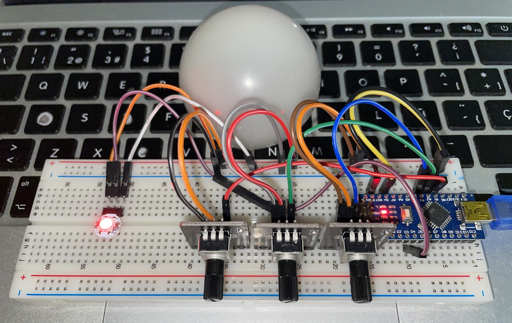
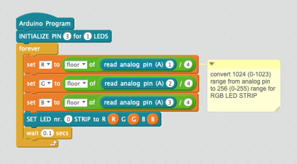

# light-mixer
A simple gadget to experiment with RGB light color mixing.

It uses an Arduino Nano, a Neopixel RGB LED and 3 potentiometer: the schematic is in the `schematic`folder (in [Fritzing](https://fritzing.org) format).

The code is in the `src` folder. The firmware was created -for simplicity- with **mBlock-3** ([Windows](https://dl.makeblock.com/mblock3/mBlock_win_V3.4.12.exe) and [Macos](https://dl.makeblock.com/mblock3/mBlock_mac_V3.4.12.zip) downloads), using the [NeoPixel by Robokacija 1.0 extension](https://www.mblock.cc/extensions/uploads/3478f9455438fe7979553f09d80008df12dddc49.zip), but the Arduino code generated is also available.

## LICENCIA / LICENSE

Este trabajo esta sujeto a la licencia [GNU General Public v3.0 License](LICENSE-GPLV30). Todos los ficheros multimedia y de datos que no sean código fuente están sujetos a la licencia [Creative Commons Attribution 4.0 BY-SA license](LICENSE-CCBYSA40).

Más información acerca de estas licencias en [licencias Opensource](https://opensource.org/licenses/) y [licencias Creative Commons](https://creativecommons.org/licenses/).

This work is licensed under the [GNU General Public License v3.0](LICENSE-GPLV30). All media and data files that are not source code are licensed under the [Creative Commons Attribution 4.0 BY-SA license](LICENSE-CCBYSA40).

More information about licenses in [Opensource licenses](https://opensource.org/licenses/) and [Creative Commons licenses](https://creativecommons.org/licenses/).