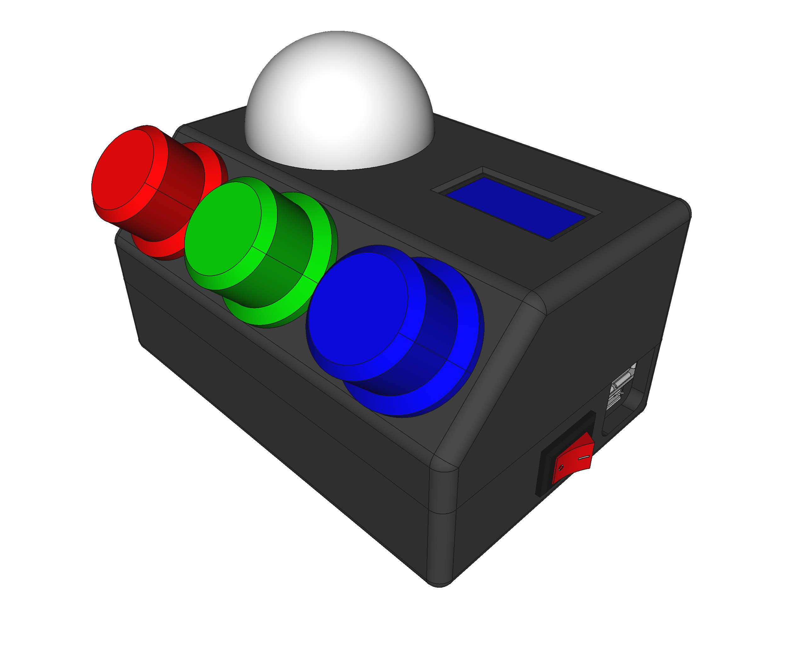
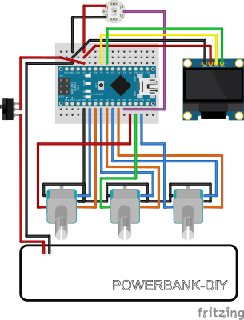
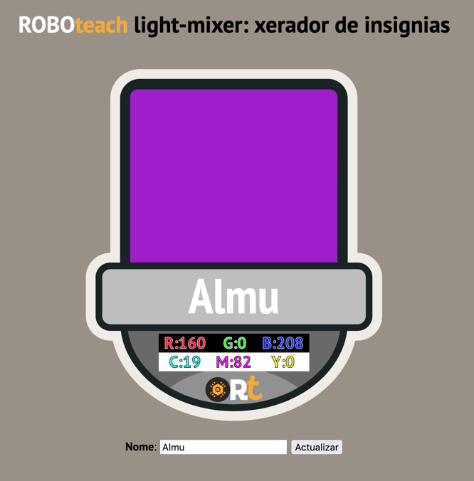

# light-mixer
A not so simple gadget to experiment with RGB light color mixing. Obtain your own **Personal Color Badge** through the generated QR-Code.

## With ENCODERS

This is the new iteration that uses three rotary encoders, an Arduino Nano, a Neopixel RGB LED, an OLED 0.96" screen and a rechargable power system (based on a [DIY Power-Bank](https://www.roboteach.es/modificacion-power-bank/)). It also uses a ping-pong ball as the main light diffuser.

The 3D model was created with [FreeCAD](https://freecadweb.org) and is available in the `3D` folder. The STL models are also available if you just want to print them.

The schematic is available in the `schematic` folder (in [Fritzing](https://fritzing.org) format), and the firmware/code in the `src` folder, ready to be uploaded to the Arduino Nano with the *Arduino IDE* (or your prefered method). It requires two libraries:

  * QRCode by Richard Moore ([here](https://github.com/ricmoo/qrcode/))
  * ssd1306 by Alexey Dynda ([here](https://github.com/lexus2k/ssd1306))

## With POTENTIOMETERS

This was the first iteration, a simpler one: it uses an Arduino Nano, a Neopixel RGB LED and 3 potentiometer: the schematic is in the `schematic` folder (in [Fritzing](https://fritzing.org) format).

The code is in the `src` folder. The firmware was created -for simplicity- with **mBlock-3** ([Windows](https://dl.makeblock.com/mblock3/mBlock_win_V3.4.12.exe) and [Macos](https://dl.makeblock.com/mblock3/mBlock_mac_V3.4.12.zip) downloads), using the [NeoPixel by Robokacija 1.0 extension](https://www.mblock.cc/extensions/uploads/3478f9455438fe7979553f09d80008df12dddc49.zip), but the Arduino code generated is also available.

## QR-Code

Yes, another gadget that produces QR-Codes: if you press (and mantain) the blue knob, you'll get a QR-Code on the screen that takes you to the badge generator webapp, a PHP app that is also part of this project (open-source and included in the `src\lm-badge` folder), that produces a **Personal Color Badge** with your own color and its numerical components, both in RGB and CMY formats.

Example of a badge at: https://www.roboteach.es/lm-badge/?c=a000d0&n=Almu

## LICENCIA / LICENSE

Este trabajo esta sujeto a la licencia [GNU General Public v3.0 License](LICENSE-GPLV30). Todos los ficheros multimedia y de datos que no sean código fuente están sujetos a la licencia [Creative Commons Attribution 4.0 BY-SA license](LICENSE-CCBYSA40).

Más información acerca de estas licencias en [licencias Opensource](https://opensource.org/licenses/) y [licencias Creative Commons](https://creativecommons.org/licenses/).

This work is licensed under the [GNU General Public License v3.0](LICENSE-GPLV30). All media and data files that are not source code are licensed under the [Creative Commons Attribution 4.0 BY-SA license](LICENSE-CCBYSA40).

More information about licenses in [Opensource licenses](https://opensource.org/licenses/) and [Creative Commons licenses](https://creativecommons.org/licenses/).